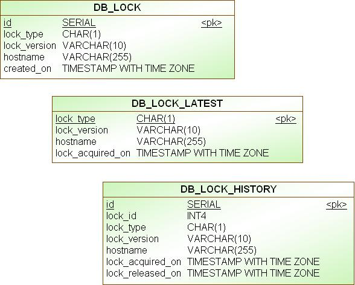

# OpenTMF DB Lock Service
Helper service for obtaining a cluster level lock using the client application's JDBC datasource.

The library will autoconfigure itself on the condition of spring.datasource.url configuration property.

It allows the acquisition of locks depending on the supported lock types.

The acquired locks are scheduled to be released automatically after a certain timeout is reached, in order to get rid of situations where the caller application cannot release the lock.

## Created Database Tables
This library creates 3 database tables and interacts with them using pure JDBC and manual transaction processing. Spring's JdbcTemplate is just used to obtain the database connections from the underlying DataSource.

| Table Name      | Description                                                |
|-----------------|------------------------------------------------------------|
| DB_LOCK         | Keeps the current locks per lock_type                      |
| DB_LOCK_LATEST  | The latest applied lock & application version relationship |
| DB_LOCK_HISTORY | The history of established and released locks.             |

---



## Supported Configuration Properties

The following configuration properties are recognized by the service:

```yaml
opentmf:
    db-lock:
      create-tables: true
      lock-acquire-poll-interval: 1000
      lock-acquire-timeout: 120000
      lock-hold-timeout: 300000
 ```
The timeout values are in milliseconds and the above table contains the default values. If the default values satisfies the use case of the application, providing those properties is optional.

Similarly, create-tables property is true by default, which causes the required tables to be created automatically at the application start, if they not already exist. The creation script is for PostgreSQL. However, to use the library with other database vendors, it is possible to set this property to false and create the tables through your application mechanism, for example manually, or with the help of liquibase.

Starting from version 1.0.6, you can override the lock-acquire-poll-interval, lock-acquire-timeout and lock-hold-timeout values per supported lock type.

For example, if you want to override the default values for the particular lock type = LOCK_X and LOCK_Y you can define the following properties:

```yaml
opentmf:
    db-lock:
      create-tables: true
      lock-acquire-poll-interval: 1000
      lock-acquire-timeout: 120000
      lock-hold-timeout: 300000
      duration-overrides:
        lock-x:
          lock-acquire-poll-interval: 100
          lock-acquire-timeout: 1000
          lock-hold-timeout: 2000
        lock-y:
          lock-acquire-poll-interval: 200
          lock-acquire-timeout: 2000
          lock-hold-timeout: 4000
 ```
If an overridden duration is not specified for a particular lock type, then the default values are used, which pertains the old behaviour. 

## Usage
The opentmf-db-lock-library is automatically included from camunda7-bpmn-sync-service and dnext-catalog-sync-service. Therefore, there is no need to include a dependency to it, if the client uses one of the mentioned libraries.

However, it is also possible to directly give a dependency to this library, for certain tasks that require to be performed within a cluster level lock plus to keep version history of successful completions.

### Import opentmf-commons-versions
```xml
<dependencyManagement>
  <dependencies>
    <dependency>
      <groupId>org.opentmf</groupId>
      <artifactId>opentmf-versions</artifactId>
      <version>RELEASE</version>
      <type>pom</type>
      <scope>import</scope>
    </dependency>
  </dependencies>
</dependencyManagement>
```
### Add Maven Dependency
```xml
<dependency>
  <groupId>org.opentmf.util</groupId>
  <artifactId>opentmf-db-lock-service</artifactId>
</dependency>
```
### Implementation with `@UsingClusterLock`
`@UsingClusterLock` annotation is provided by the opentmf-db-lock-service to simplify acquiring and releasing locks. After acquiring the specified lock, it executes the code within the service method and releases the lock after the method ends.

Below is: a sample service implementation with `@UsingClusterLock` annotation:

```java
@Service
@Slf4j
public class SomeServiceImpl implements SomeService {

  @UsingClusterLock(lockType = LockType.LOCK_X, requestedVersion = "${test.properties.version}")
  public void performTask() {
    log.debug("Performing task inside a cluster level lock.");
  }
}
```
This code will cause the following:
- A lock will be acquired for lockType = X
- If the lock cannot be acquired within the configured duration or attempts:
  - Then the service method will not be executed.
- Else:
  - If one of the following conditions are met:
    - no previous lock of that lockType exists,
    - previous lock version is lower than the requested
    - previous lock version is equal to the requested and `executeOnSameVersion` flag is set to true
    - previous lock version is greater than the requested and the `downgradeAllowedMillis` duration is met (i.e. rollback is applicable)
  - Then the service method will be executed.
  - Otherwise, the service method will NOT be executed.
- And finally, the acquired lock will be released.
  - If the service method was executed and successful, the `db_lock_latest` record will be updated.

If you need the details of lock in your service methods, you can add a parameter with `LockContext` type in your methods, then `@UsingClusterLock` will inject the lock details into this new parameter. When calling your service methods in other services, you need to initialize a new `LockContext` object and pass it to the method.

Below is the `LockContext` class:
```java
@Getter
@Setter
public class LockContext {

  /**
   * The resolved value of the <code>requestedVersion</code> parameter of <code>@UsingClusterLock
   * </code>.
   */
  private String requestedVersion;

  /**
   * The latest successfully performed lock details. Can be NULL if no previous lock exists.
   */
  private LatestLock latestLock;

  /**
   * Represents the version transition between the previous lock version and the requested version.
   */
  private VersionTransition versionTransition;

  /**
   * Returns true if this is the initial lock that we have acquired, false otherwise.
   * @return true if this is the initial lock that we have acquired, false otherwise.
   */
  public boolean isInitial() {
    return latestLock == null;
  }

  /**
   * Returns true is this is an upgrade.
   * <p>
   * An upgrade means, either there is no successfully executed previous lock, or the current
   * requested lock version is greater than the previous successful lock.
   * </p>
   *
   * @return true is this is an upgrade, false otherwise.
   */
  public boolean isUpgrade() {
    return versionTransition == VersionTransition.UPGRADE;
  }

  /**
   * Returns true is this is a downgrade and this downgrade is allowed to be executed.
   * <p>
   * A downgrade which means the requested version is saller than the latest successfully completed
   * version and the downgradeAllowedMillis has been reached. So we must be going for a downgrade.
   * </p>
   *
   * @return Returns true is this is a downgrade and this downgrade is allowed to be executed, false
   * otherwise.
   */
  public boolean isDowngrade() {
    return versionTransition == VersionTransition.DOWNGRADE;
  }

  /**
   * Returns true if the requested and obtained lock version is the same as the latest successfully
   * executed lock version. There can be cases where a business logic must be executed each time a
   * lock is obtained, even though it is the same as the latest lock version.
   *
   * @return true if the requested and obtained lock version is the same as the latest successfully
   * * executed lock version, false otherwise.
   */
  public boolean isSameVersion() {
    return versionTransition == VersionTransition.SAME_VERSION;
  }
}

```
And below is the contents of the `LatestLock` class:
```java
/**
 * The latest successfully performed lock's details.
 *
 * @author Gokhan Demir
 */
@RequiredArgsConstructor
@Getter
@ToString
public class LatestLock {

  /**
   * The latest successfully performed lock's version.
   */
  private final String lockVersion;

  /**
   * The latest successfully performed lock was release at this date-time.
   */
  private final OffsetDateTime lockReleasedAt;
}
```
An example of reaching the attributes of the LockContext inside the service method implementation that contains a LockContext parameter:

```java
@Slf4j
@Service
public class SomeServiceImpl implements SomeService {

  @UsingClusterLock(lockType = LockType.LOCK_Y, requestedVersion = "${test.properties.version}")
  public void performTask(String arg1, LockContext ctx, Long arg2) {

    // log resolved requestedLock version string
    log.debug("Requested lock version: {}, previous lock: {}",
            ctx.getRequestedVersion(), ctx.getLatestLock());
    
    if (ctx.isInitial()) {
      // POST
    } else {
      // PATCH
    }
  }
}
```
You can call above method in other services as below;

```java
@RestController
@RequiredArgsConstructor
public class SomeOtherServiceImpl implements SomeOtherService {

  private final SomeService someService;

  public void performTask() {
    someService.performTask("test", new LockContext(), 4L);
  }
}
```

If you want your service method to be executed even if the previous lock version and requested version are the same, you can set the `executeOnSameVersion` flag to true in the `@UsingClusterLock` annotation.

```java


@Slf4j
@Service
public class SomeServiceImpl implements SomeService {

  @UsingClusterLock(
      lockType = LockType.LOCK_X,
      requestedVersion = "${test.properties.version}",
      executeOnSameVersion = true)
  public void performTask(LockContext ctx) {

    if (ctx.isInitial()) {
      log.debug("This is the initial obtained lock for the requested lock type. 
          + "Perform the initial tasks.");

    } else if (ctx.isUpgrade()) {
      log.debug("The requested version is higher than the previous lock version."
          + "Do the upgrade.");

    } else if (ctx.isDowngrade()) {
      log.debug("The requested version is lower than the previous lock version "
          + "and enough milliseconds has already passed to allow a downgrade. "
          + "Do the downgrade.");

    } else if (ctx.isSameVersion()) {
      log.debug("The requested version is the same as the previous lock version."
          + "Do whatever you need to do within the obtained lock");
    }
  }
}
```

## Version History
### 1.0.0
- Initial Version
### 1.0.1
- Documentation fixes
### 1.0.2
- Adds `@UsingClusterLock` annotation
### 1.0.3
- Adds support for `LockContext` parameter in methods annotated with `@UsingClusterLock` to retrieve lock details.
### 1.0.4
- Updates dependent library versions to their latest.
### 1.0.5
- **Heads Up**: Backward Incompatible version.
- Updates execution logic of `@UsingClusterLock`, adds `executeOnSameVersion` flag to be able to execute the service method even if the lock version is not changed.
- Introduces `VersionTransition` enum to represent a version transition between two versions.
- Updates the `LockContext` class, adds `versionTransition` attribute and removes `upgrade` field.
- Updates `AcquiredLock` class, adds new methods to calculate the version change and to check if downgrade is allowed. Removes methods taking lockVersion as a parameter, since now AcquiredLock also contains this information.
### 1.0.6
- **Enhancement**: You can now override lockAcquirePollInterval, lockAcquireTimeout and lockHoldTimeout per supported lockType.
- Updates Spring Boot to version 3.4.0
### 1.0.7
- Updated creation script for PostgreSQL to include begin and commit transaction
### 1.0.8
- Initial open-source version
